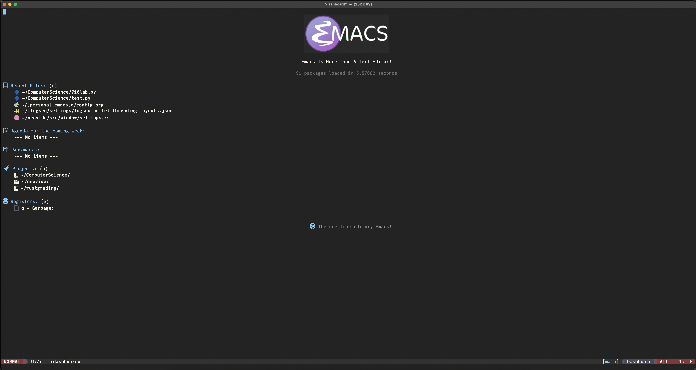
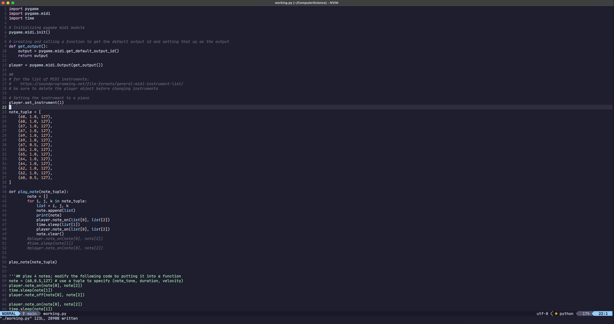

- [Bio about me:](#bio-about-me)
- [Tools I use:](#tools-i-use)
  - [My beliefs when it comes to software:](#my-beliefs-when-it-comes-to-software)
  - [Now what tools do I **actually** use:](#now-what-tools-do-i-actually-use)
  - [NEED TO ADD EVERYTHING ELSE](#need-to-add-everything-else)
- [CSCEA101](#cscea101)
  - [Week 11:](#week-11)
- [PSA](#psa)

## Bio about me:
- TODO

## Tools I use: 
I use a specific set of tools to help improve my workflow. The reason I use the tools I do stems from my personal beliefs and opinions. 
### My beliefs when it comes to software:
- I do not for any reason want to be tracked or monetized unless I have a say in it. I use an Apple M1 Macbook Air. I'm sure Macos has some trackers in it and profiles me in some way, **Most things do**. However, I have made the decision to use Macos and a Macbook because it has real benifits. 
  - Those benifits are:
    - Speed:
      - The M1 Macbook is probably the fastest computer I have ever used. It flies through the tasks I need it to perform even with only 8 GB's of ram. 
    - Battery Life:
      - I chose a laptop because I wanted to be able to take my computer around with me and the Macbook is perfect for that. The M1 chip has incredible battery life I rarely need to charge it.
    - *Some* feature parity with Linux:
      - Unfortunately, it isn't perfect due to both Apple's sometimes unorthodox or downright anti-consumer practices, and because the M1 chip sometimes isn't compatible with software. 
    - I have other reasons, but they aren't lengthy enought to discuss.
### Now what tools do I **actually** use:
I like a lot of other people struggle with with the **collector's fallacy**. I feel the need to always be trying new tools, and always feel the need to increase my productivy with new things. Unfortunately, this constant search actively hurts my productivity. My way of counteracting this is to use software that doesn't invite me to constantly hack away at it. 

For example when it comes to code editors I have used too many:

- First it was Visual Studio Code:
  - Used it for a couple of days, but the trackers and telemetry made me uncomfortable. Not to mention it was slow on my computer. 
- Next it was Emacs.
  - Spent a couple months with Emacs:
    - First it was Doom Emacs.
      - My configuration was nice and I liked it, but the collectors fallacy kicked in and I soon decided I had to change my setup.
    - Second I made my own configuration file:
      - It was long and made in Org-Mode. It was nice, and I was proud of what I produced but I spent way to much time on it.
      
- Third it was Neovim:
  - Neovim was really cool, but it sucked up a lot of my time. It is a lot more technical than Emacs, and in my opinion much easier to break. Almost to the point that it made me not even want to use it. I ended up just cloning someone else's config and adding some stuff in on top of it. 
  
- Lastly I came back to Visual Studio Code (kind of):
  - The reason I chose to switch to Visual Studio Code is long, but in brief I needed to uncomplicate my setup. I had to many things going on, and in addition I wanted to start using Foam as my note taking system. It also **finally** had a native m1 mac build which made it run as fast as any other editor.
  - I stayed on regular Visual Studio Code for around three days before switching to VSCodium which is a fork of Visual Studio Code. The reason being is that Visual Studio Code is open source, but when you download it you technically get the version Microsoft builds which has telemetry. VSCodium simply provides prebuilt binaries of Visual Studio Code without the telemetry. It unfortunately does not have a native m1 mac build, but I was able to build it myself with arm support and now it runs like lightning. It's the best of both worlds, and I am able to use Foam. 
  
  ### NEED TO ADD EVERYTHING ELSE
  - TODO
  

## CSCEA101

### Week 11:

[Week 11 Content Map](notes/Week11.md)

## PSA
This is going to be my own personal repository of knowledge as I work my way through a computer science degree at the University of Alaska Anchorage. I for one do not care if you wish to learn from my notes, but do not simply take what I have written and submit it. **_Especially_** if you are a student at UAA. 