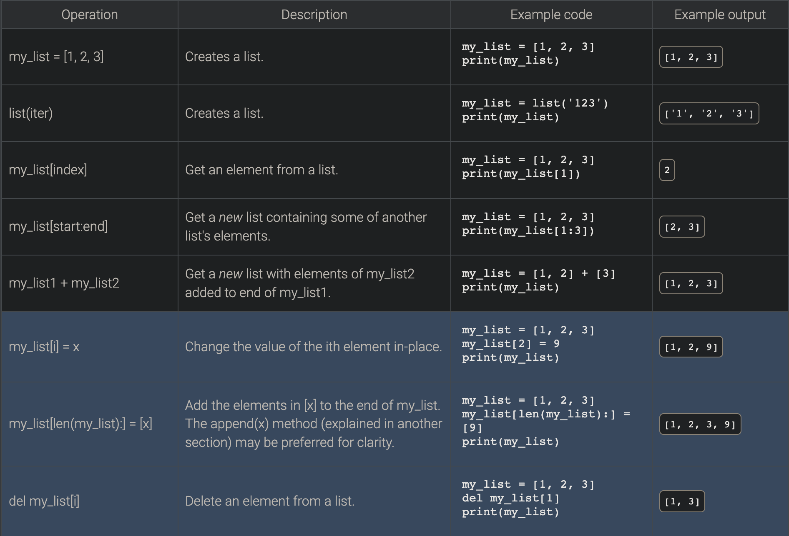

# Lists

## 10.1 Lists

The **list** object type is one of the most important and often used types in a Python program. 

- A list is a **container** which is an object that groups related objects together.
    - Is also a Sequence
    - Contain objects maintain a left to right positional ordering. 
    - Elements of a list can be accessed via indexing operations. 
        - Have to specify the position of the desired element in the list. 
    - Can be created using the built-in `list()` function
      - The function accepts a single iterable object argument.
        - Ex:
          - String
          - List
          - Tuple
      - Returns a new list object.
        - Ex:
          - `list('abc')` returns a list with the elements `['a', 'b', 'c']`
## Accessing List elements

### What is an index?
- An **_index_** is a zero-based integer matching to a specific position in list of elements.
  - Ex:
    - A list called `my_list` consists of the following elements `['a', 'b', 'c']`
    - Calling `my_list[1]` returns `b`
      - If it's easier to remember the formula is (i+1)
        - Calling element `[0]` calls element 1 in the list.
          - 0 + 1 = 1
### Common List operations
- Here is a good graphic of some common list operations. 

